# 📐 System Architecture

The Collaborative Personal Scheduler is built on a robust, scalable architecture that leverages modern technologies for seamless collaboration, real-time updates, and secure data management.

---

## 🗂️ High-Level Overview

```mermaid
flowchart LR
    %% Frontend Section
    subgraph FE[Frontend: React.js]
        FE1["🖥️ React.js SPA"]
        FE2["📅 FullCalendar.js"]
        FE3["🔗 Axios (REST API)"]
        FE4["⚡ Socket.IO Client"]
        FE5["🗂️ Redux/Zustand"]
        FE6["🎨 TailwindCSS / Material UI"]
    end

    %% Backend Section
    subgraph BE[Backend: Spring Boot]
        BE1["🌐 REST Controllers"]
        BE2["🔔 WebSocket Endpoints"]
        BE3["🧠 Service Layer"]
        BE4["🔒 Spring Security + JWT"]
        BE5["🗄️ Spring Data JPA (Hibernate)"]
        BE6["✉️ Spring Mail"]
    end

    %% Database Section
    subgraph DB[Database]
        DB1["🗃️ PostgreSQL / MySQL"]
    end

    %% External Services Section
    subgraph EX[External Services]
        EX1["📤 SMTP Server (Gmail/SendGrid)"]
    end

    %% Data Flow
    FE3 --> BE1
    FE4 --> BE2
    BE1 --> BE3
    BE2 --> BE3
    BE3 --> BE5
    BE5 --> DB1
    BE6 --> EX1
    BE4 -. Security Validation .-> BE1
    BE4 -. Security Validation .-> BE2

    %% UI Connections
    FE1 --> FE2
    FE1 --> FE5
    FE1 --> FE6
```

---

## 📝 Component Descriptions

### **Frontend**

- **React.js SPA:** Responsive single-page application for user interaction.
- **FullCalendar.js:** Interactive calendar interface.
- **Axios:** Handles RESTful API communication.
- **Socket.IO Client:** Enables real-time updates.
- **Redux/Zustand:** State management for UI and data.
- **TailwindCSS / Material UI:** Modern, accessible UI components.

### **Backend**

- **Spring Boot:** Core RESTful API and business logic.
- **REST Controllers:** Handle HTTP requests and responses.
- **WebSocket Endpoints:** Real-time event and calendar updates.
- **Service Layer:** Business logic and orchestration.
- **Spring Security + JWT:** Authentication and authorization.
- **Spring Data JPA (Hibernate):** ORM for database operations.
- **Spring Mail:** Automated email notifications.

### **Database**

- **PostgreSQL / MySQL:** Reliable, scalable relational data storage.

### **External Services**

- **SMTP Server (Gmail/SendGrid):** Email delivery for notifications and invitations.

---

## 🗒️ Notes

- **Scalability:** Modular design supports future feature expansion.
- **Security:** JWT-based authentication and role management.
- **Collaboration:** Real-time sync and notifications for seamless teamwork.
