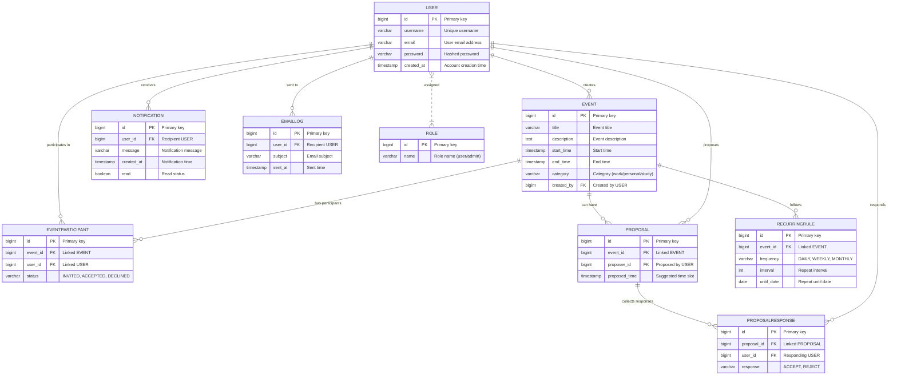

# 📊 Entity Relationship Diagram

The following diagram and entity definitions describe the core data model for the Collaborative Personal Scheduler. This enhanced version improves clarity, adds missing relationships, and uses consistent naming and comments.

---

---

## 📝 Entity Highlights

- **USER:** Core user profile, linked to events, proposals, notifications, and roles.
- **ROLE:** Supports role-based access (user/admin).
- **EVENT:** Calendar event with category, creator, and recurrence.
- **EVENTPARTICIPANT:** Tracks user participation and status for events.
- **RECURRINGRULE:** Defines event repetition patterns.
- **PROPOSAL:** Suggests alternative time slots for events.
- **PROPOSALRESPONSE:** Collects user responses to proposals.
- **NOTIFICATION:** In-app alerts for users.
- **EMAILLOG:** Tracks sent emails for auditing and troubleshooting.

---

> For further details on API usage and business logic, refer to the documentation files in this repository.
