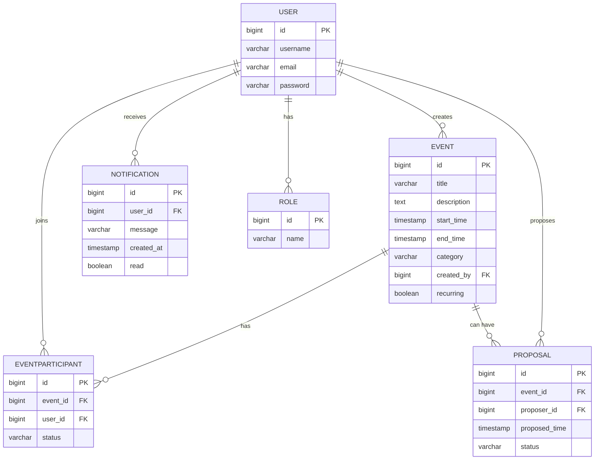

# 📊 Entity Relationship Diagram

The following diagram and entity definitions describe the core data model for the Collaborative Personal Scheduler.

---

---

## 📝 Entity Highlights

- **USER:** Stores user credentials and profile information. Can create events, propose meet-ups, receive notifications, and have roles.
- **ROLE:** Defines user roles (e.g., user, admin) for access control.
- **EVENT:** Represents a calendar event with details, category, creator, and recurrence flag.
- **EVENTPARTICIPANT:** Links users to events, tracking their participation status (invited, accepted, declined).
- **PROPOSAL:** Allows users to propose alternative time slots for events, with status tracking.
- **NOTIFICATION:** Delivers messages and alerts to users about events, proposals, and other actions.

---
