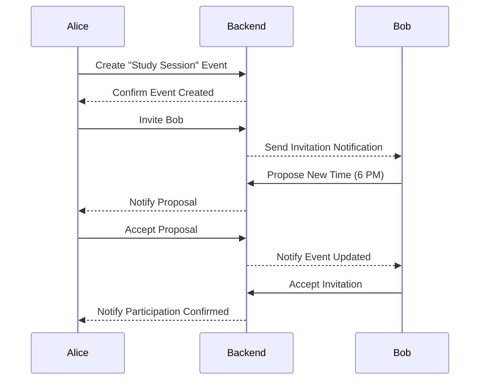

# 📈 Collaborative Event Flow

Below is a simplified sequence diagram showing how two users, Alice and Bob, collaborate to schedule an event.

---

---

## 📝 Flow Steps

1. **Event Creation:** Alice creates an event.
2. **Invitation:** Alice invites Bob.
3. **Proposal:** Bob suggests a new time.
4. **Acceptance:** Alice accepts the new time.
5. **Confirmation:** Bob confirms his participation.

---
